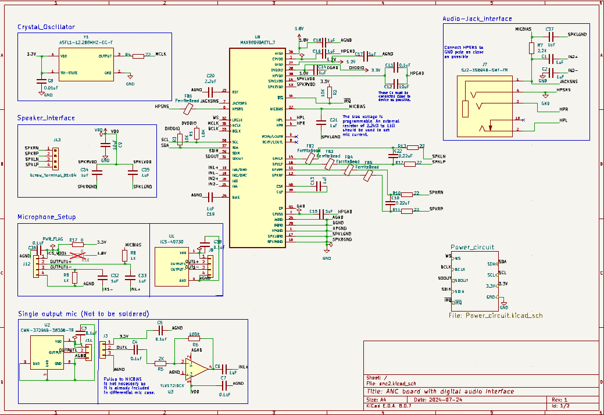

## 1. The device tree overlay for the MAX98090 audio codec
\- Raspberry Pi 4 Model B Rev 1.5, armv7l architecture.

**Note**: 
* The driver files for this codec are obtained from [this](https://github.com/raspberrypi/linux/blob/rpi-6.6.y/sound/soc/codecs/max98090.c) repository.
* The device-tree binding is referred from [max98090](https://github.com/raspberrypi/linux/blob/rpi-6.6.y/Documentation/devicetree/bindings/sound/maxim%2Cmax98090.yaml).
* Before adding the DTS file, make sure that the module for the drivers to your device (audio codec) is available ([steps to check](#3.-Verification-commands)), else first complete [these steps](#2.-Steps-to-re-configure-the-kernel-for-module-generation).
> For Master/Slave configuration:<br>
> By default the DTS file is written to configure the codec as master.<br>
> To configure it to slave, copy-paste [codec_slave](codec_slave.txt) in .dts file and compile.<br>

To edit this DTS file,<br>
 ```$ sudo nano max98090.dts```<br>
 
To compile it to .dtbo file,<br>
 ```$ dtc -@ -I dts -O dtb -o max98090.dtbo max98090.dts```<br>
 
To copy it to the overlays directory,<br>
 ```$ sudo cp max98090.dtbo /boot/firmware/overlays/```<br>
 
Ensure to add it in config.txt file,<br>
 ```$ sudo nano /boot/firmware/config.txt```<br>
 
Then add,<br>
 ```dtoverlay = max98090``` before that make sure if ```dtparam=i2s=on``` is uncommented in config.txt, otherwise the external I2S interface in RPi'S GPIO will be disabled.<br>
 
Then reboot your RPi with the following command,<br>
 ```$ sudo reboot```

**For more info about devicetree:**
- https://elinux.org/Device_Tree_Reference
- https://elinux.org/images/c/cf/Power_ePAPR_APPROVED_v1.1.pdf

## 2. Steps to re-configure the kernel for module generation
For the driver module of the max98090, you should have reconfigured the kernel image. The following steps are mentioned for the [cross-compilation](https://www.raspberrypi.com/documentation/computers/linux_kernel.html#cross-compile-the-kernel),<br>
```
$ git clone https://github.com/raspberrypi/linux
$ cd linux/
$ sudo apt install bc bison flex libssl-dev make libc6-dev libncurses5-dev
$ sudo apt install crossbuild-essential-armhf
$ export KERNEL=kernel7l
$ make ARCH=arm CROSS_COMPILE=arm-linux-gnueabihf- bcm2711_defconfig #(2711 for RPi4)
$ make ARCH=arm CROSS_COMPILE=arm-linux-gnueabihf- menuconfig
```
Make the following module configurations in [menuconfig](https://www.raspberrypi.com/documentation/computers/linux_kernel.html#menuconfig),<br>
> |-> Device Drivers<br>
> |---> Sound card support<br>
> |-----> Advanced Linux Sound Architecture<br>
> |-------> ALSA for SoC audio support<br>
> |---------> CODEC drivers<br>
> |-----------> Maxim MAX98090 CODEC
```
$ make -j$(nproc) ARCH=arm CROSS_COMPILE=arm-linux-gnueabihf- zImage
$ make -j$(nproc) ARCH=arm CROSS_COMPILE=arm-linux-gnueabihf- dtbs
$ make -j$(nproc) ARCH=arm CROSS_COMPILE=arm-linux-gnueabihf- modules
```
Then, [find your boot media](https://www.raspberrypi.com/documentation/computers/linux_kernel.html#find-your-boot-media).<br>
Once all these are done, you must include the modules in your root media.<br>
```
$ sudo env PATH=$PATH make -j$(nproc) ARCH=arm CROSS_COMPILE=arm-linux-gnueabihf- INSTALL_MOD_PATH=mnt/root modules_install #[run on host sys]
$ sudo cp mnt/boot/$KERNEL.img mnt/boot/$KERNEL-backup.img 
$ cp arch/arm/boot/zImage /boot/kernel7l.img
$ sudo cp arch/arm/boot/dts/broadcom/*.dtb mnt/boot/
$ sudo cp arch/arm/boot/dts/overlays/*.dtb* mnt/boot/overlays/
$ sudo cp arch/arm/boot/dts/overlays/README mnt/boot/overlays/
$ sudo umount mnt/boot
$ sudo umount mnt/root
```
In **RPi**,<br>
As it is mentioned that the kernel headers are already included in the source tree, I just copied the entire cloned repo in the `/usr/src/` directory and it worked.

**Note**: This avoids the issue with the header of the build directory `ls -l /usr/lib/modules/build` pointing to the host system (used for cross compilation) instead of pointing to the source directory (linux-header) from `/usr/src/`. Thus kernel can point to the right kernel source version.

For installing only the [linux header](https://www.raspberrypi.com/documentation/computers/linux_kernel.html#kernel-headers) file without any additional file,<br>
```$ sudo apt install linux-headers-rpi-{v6,v7,v7l}```<be>

Then in your /boot/firmware/config.txt, add<br>
```kernel=kernel7l.img```<br>
Also, if the architecture of your OS is armv7l but it shows aarch64 when `uname -a`, then add this in config.txt<br>
```arm_64bit=0```<br>
but if it is the countercase, then add<br>
```arm_64bit=1```<br>


## 3. Verification commands
To check if the driver and overlay is loaded.
```
$ sudo vclog -m | grep max98090 (or) sudo vcdbg log msg | grep max98090
$ dmesg | grep -i max98090
$ lsmod | grep max98090
```
Example:
> Driver messages for,<br>
> * Master configuration:<br>
> [   9.756147] max98090 1-0010: MAX98090 REVID=0x43<br>
> [ 1593.931771] max98090 1-0010: No better method found<br>
> [ 1593.931793] max98090 1-0010: Calculating ni 24576 with mi 65536<br>
> 
> * Slave configuration:<br>
> [   10.527034] max98090 1-0010: MAX98090 REVID=0x43<br>
> [   16.134141] max98090 1-0010: PLL unlocked<br>
> [   17.185129] max98090 1-0010: PLL unlocked<br>
> [   17.254656] max98090 1-0010: PLL unlocked<br>

To check the soundcard created for playback and capture.
```
$ aplay -l
$ arecord -l
```
> Example:
> ```
> pi@raspberrypi:~ $ aplay -l
> **** List of PLAYBACK Hardware Devices ****
> card 0: Headphones [bcm2835 Headphones], device 0: bcm2835 Headphones [bcm2835 Headphones]
>   Subdevices: 8/8
>   Subdevice #0: subdevice #0
>   Subdevice #1: subdevice #1
>   Subdevice #2: subdevice #2
>   Subdevice #3: subdevice #3
>   Subdevice #4: subdevice #4
>   Subdevice #5: subdevice #5
>   Subdevice #6: subdevice #6
>   Subdevice #7: subdevice #7
> card 1: MAX98090Codec [MAX98090-Codec], device 0: fe203000.i2s-HiFi HiFi-0 [fe203000.i2s-HiFi HiFi-0]
>   Subdevices: 1/1
>   Subdevice #0: subdevice #0
> card 2: vc4hdmi0 [vc4-hdmi-0], device 0: MAI PCM i2s-hifi-0 [MAI PCM i2s-hifi-0]
>   Subdevices: 1/1
>   Subdevice #0: subdevice #0
> card 3: vc4hdmi1 [vc4-hdmi-1], device 0: MAI PCM i2s-hifi-0 [MAI PCM i2s-hifi-0]
>   Subdevices: 1/1
>   Subdevice #0: subdevice #0
> pi@raspberrypi:~ $ arecord -l
> **** List of CAPTURE Hardware Devices ****
> card 1: MAX98090Codec [MAX98090-Codec], device 0: fe203000.i2s-HiFi HiFi-0 [fe203000.i2s-HiFi HiFi-0]
>   Subdevices: 1/1
>   Subdevice #0: subdevice #0
> ```
Other commands for more details,
```
$ cat /proc/interrupts
$ sudo cat /sys/kernel/debug/clk/clk_summary
$ cat /proc/asound/modules
$ cat /proc/asound/cards
```

## 4. Configuration and testing
Once the soundcard is created, configure the codec settings as desired using alsamixer settings.<br>
```$ alsamixer -c 1``` #card 1 from example<be>

To test capture,<br>
```$ arecord -D hw:1,0 -f cd test_capture.wav``` #card 1 from example<be>

To test playback,<br>
```$ aplay test_capture.wav```<br>

If your captured file is silent, try recording with this command to determine whether there are any issues with the hardware.<br>
```$ arecord -vv -D hw:1,0 -f cd -d 10 test.wav``` #card 1 from example<br>

## 5. System schematics

